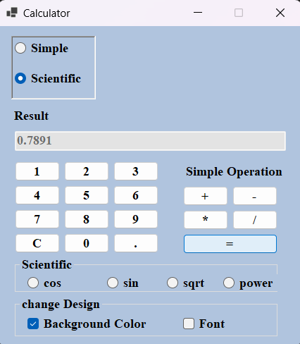

# calculator
calculator with basic and scientific functions, supporting addition, subtraction, multiplication, division, and power calculations. it also offers trigonometric and square root calculations in scientific mode. you can customize this calculator's interface by changing the background color and font. 
